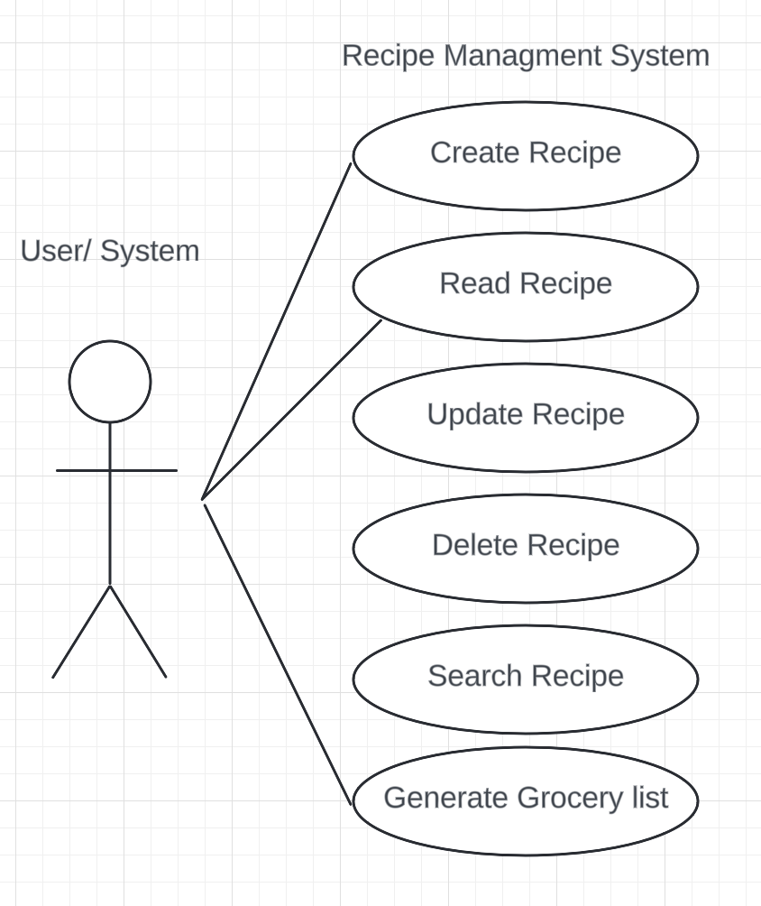
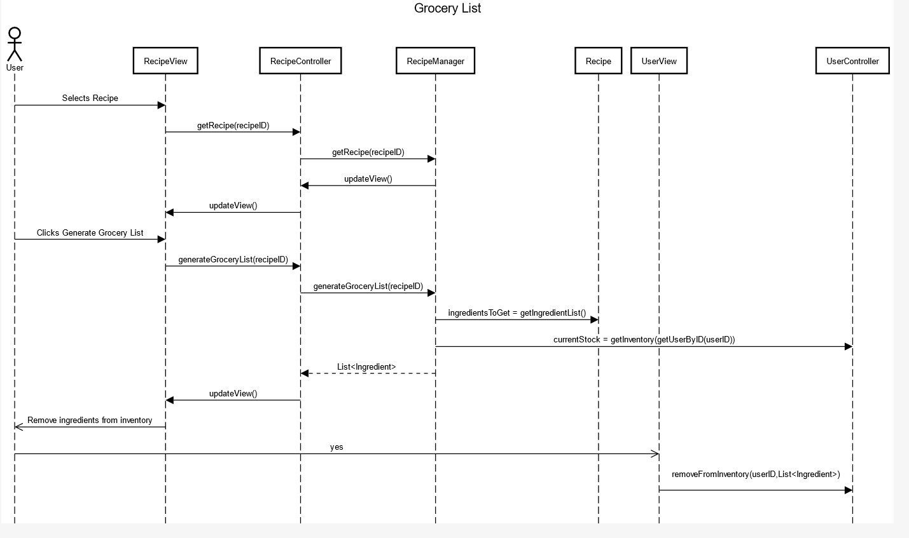

# Class Diagram 1 Name Entity Relationships

## Description
    -This diagram is intended to highlight information about the entities and their relationships.
## Diagram

## Use Case Diagram

## Sequence Diagram of Generate Grocery List
