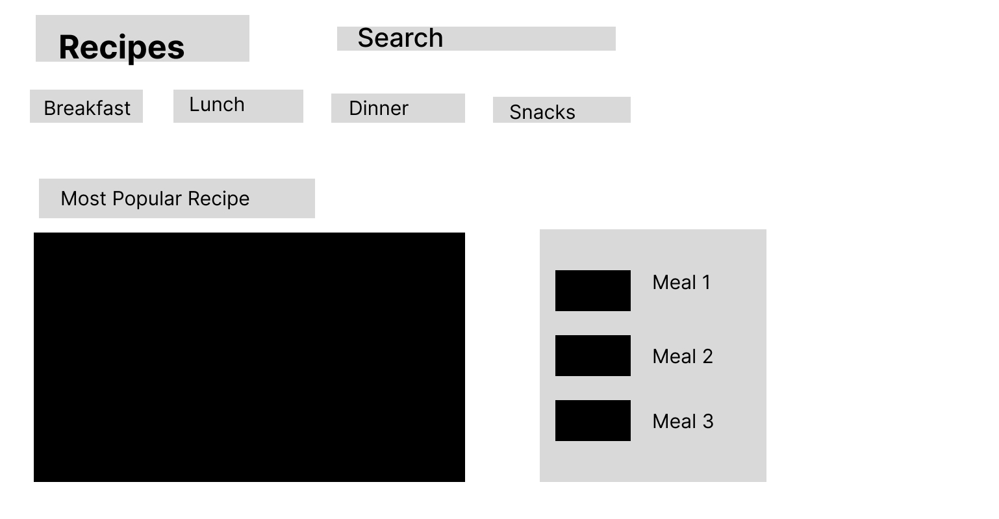
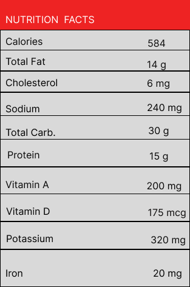
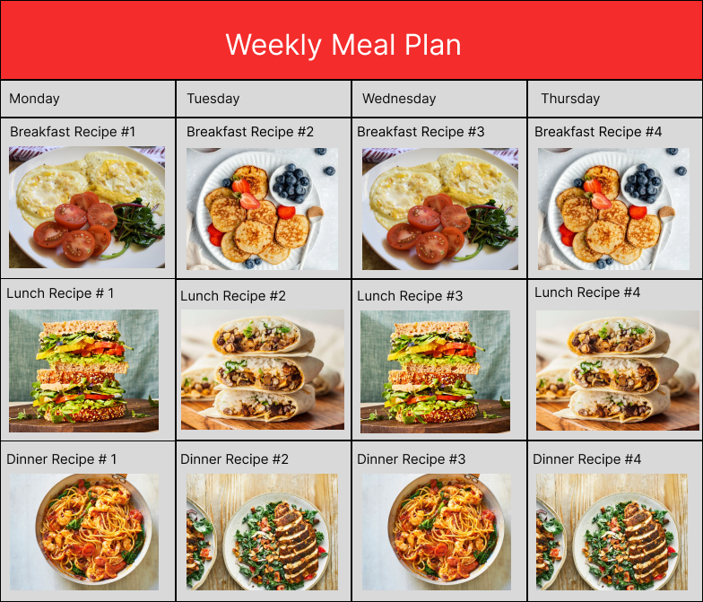
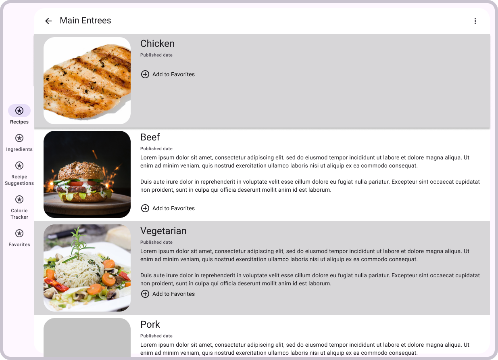
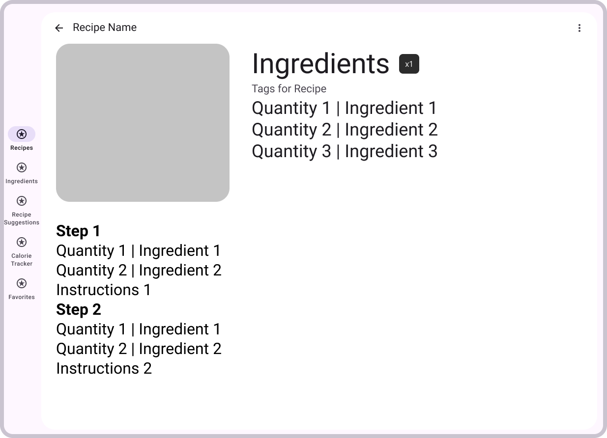

# Wireframes

## Recipe Website Example

This is an example that we might use for our layout.

## Nutritional Facts Page

This page displays the nutritional facts for the meal recipe. 

## Weekly Meal Plan Page

This page displays the weekly meal plan according to the recipes selected by the user.

## Entree Page

This page is the layout for the different categories of meals. The layout will mimic this when looking at the page Entrees vs Sides, or looking in between different recipes.

## Full Recipe

This page is the design for the actual recipe page. 

